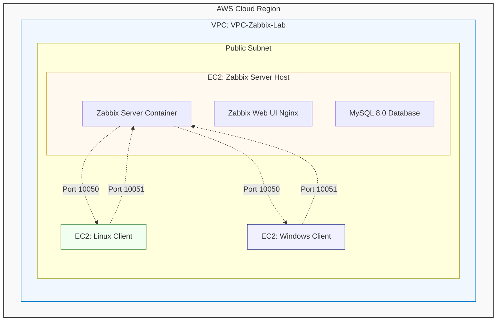

# Centralized Cloud Monitoring Infrastructure on AWS
## Deployment of Containerized Zabbix for Hybrid Park Monitoring (Linux & Windows)

---

### Project Overview
This project demonstrates the implementation of a centralized supervision infrastructure using Zabbix 7.4.6 deployed via Docker. The setup monitors a hybrid environment consisting of Ubuntu Linux and Windows Server instances hosted on AWS.

---
### Infrastructure Architecture

The following diagram illustrates the logical layout of the monitoring environment within AWS, showing the relationship between the containerized Zabbix stack and the hybrid client fleet.


---

### Infrastructure Architecture
The core environment is built upon a dedicated AWS network to ensure isolated and secure monitoring traffic.

* **VPC**: VPC-Zabbix-Lab (CIDR: 10.0.0.0/16).
* **Zabbix Server**: Ubuntu EC2 instance hosting a Dockerized stack (Zabbix Server, Web Interface, and MySQL).
* **Monitored Clients**: 
    * Ubuntu Linux EC2 Instance.
    * Windows Server EC2 Instance.


---

### Security Configuration
The infrastructure utilizes three distinct AWS Security Groups to enforce the principle of least privilege:

#### 1. Zabbix Server (SG-Zabbix-Server)
Designed to handle incoming web traffic and agent data.
* **Port 80 (HTTP)**: Web UI access.
* **Port 10051**: Zabbix Trapper for active checks and proxies.
* **Port 22 (SSH)**: Administrative access.


#### 2. Linux Client (SG-Zabbix-Linux)
* **Port 10050**: Zabbix Agent communication.
* **Port 22**: SSH access.

#### 3. Windows Client (SG-Zabbix-Windows)
* **Port 10050**: Zabbix Agent communication.
* **Port 3389**: Remote Desktop Protocol (RDP) access.

---

### Deployment Steps

#### Step 1: Server Preparation
The Ubuntu host was prepared by installing Docker and Docker Compose to support the containerized application stack.

#### Step 2: Containerized Stack Launch
The core services were deployed using a `docker-compose.yml` file, including:
* **Database**: MySQL 8.0.
* **Server**: Zabbix Server with MySQL support.
* **Web**: Zabbix Web interface backed by Nginx.

```bash
docker-compose up -d
```
#### Step 3: Agent Configuration
Zabbix Agents were deployed on target machines to collect system metrics.
**Linux**: Installed via the standard apt repository.
**Windows**: Deployed via the Zabbix MSI Agent 2 package.
**Network Setup**: All agents were configured to communicate via the Zabbix Server's Private IP (10.0.9.100) to maintain internal traffic integrity.

Monitoring Results
The final implementation provides a unified view of the infrastructure health, verifying active communication across the internal AWS network.
**CPU Utilization**: Real-time performance tracking.
**Memory Usage**: Visualized through centralized dashboard widgets.
**Availability**: Simultaneous monitoring of the Linux Client, Windows Client, and the Zabbix Server itself.


